# Installing Wire on Tails
Wire is an encrypted messaging app, available for many different platforms.
It is possible to install on Tails, a secure Linux on an USB Stick.

This guide was last tested in April 2020, using Tails 4.5 and Wire 3.16


## Configure Tails
You will need a Persistent Volume. Check the [Tails docs](https://tails.boum.org/doc/first_steps/persistence/configure/index.en.html) if you need to create one.

#### Enable Persistent Dotfiles. 
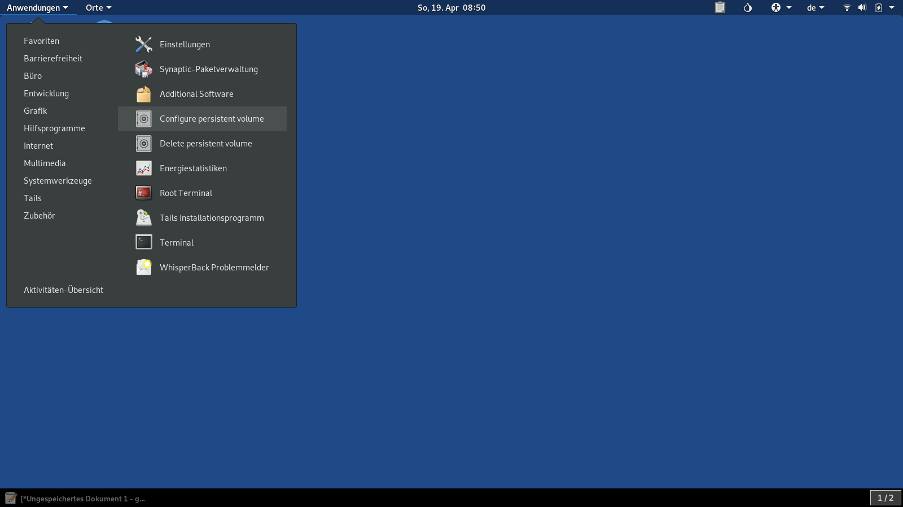
1. Open the "Configure Persistent Volume" application. You find it in the Tails application menu in the Group named "Tails".
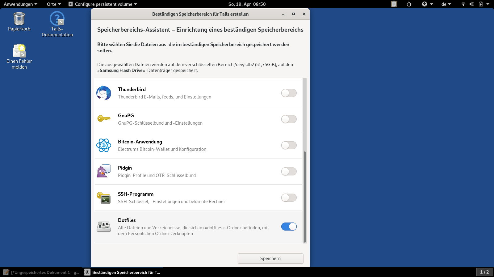
2. Enable "Dotfiles" at the bottom of the list and Save the changes.

## Download Wire

1. Go to https://wire.com/en/download/
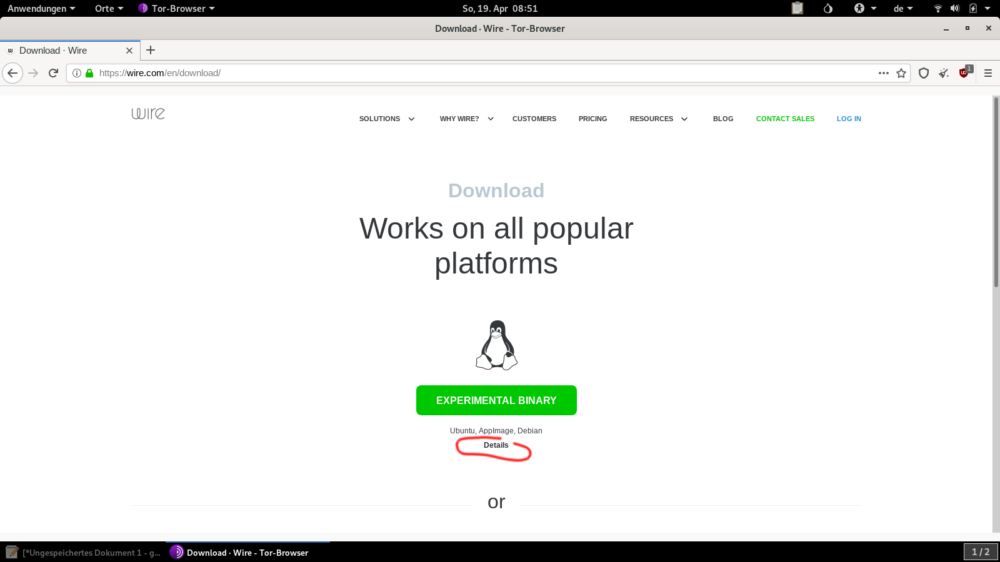
2. Click on Details
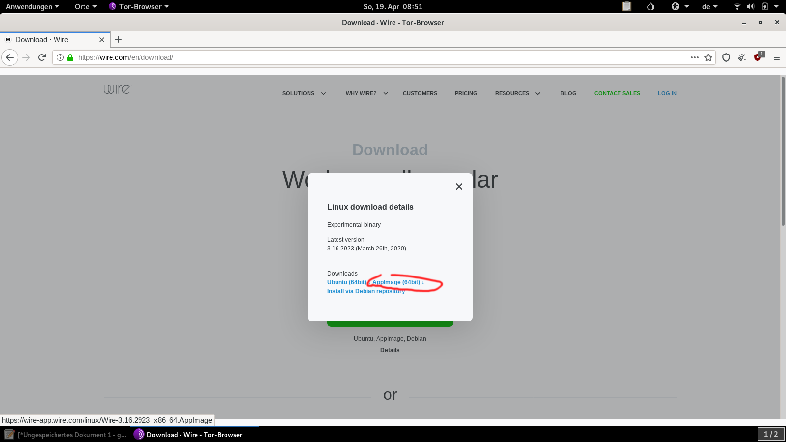
3. Choose AppImage
4. Save into the TorBrowser folder.
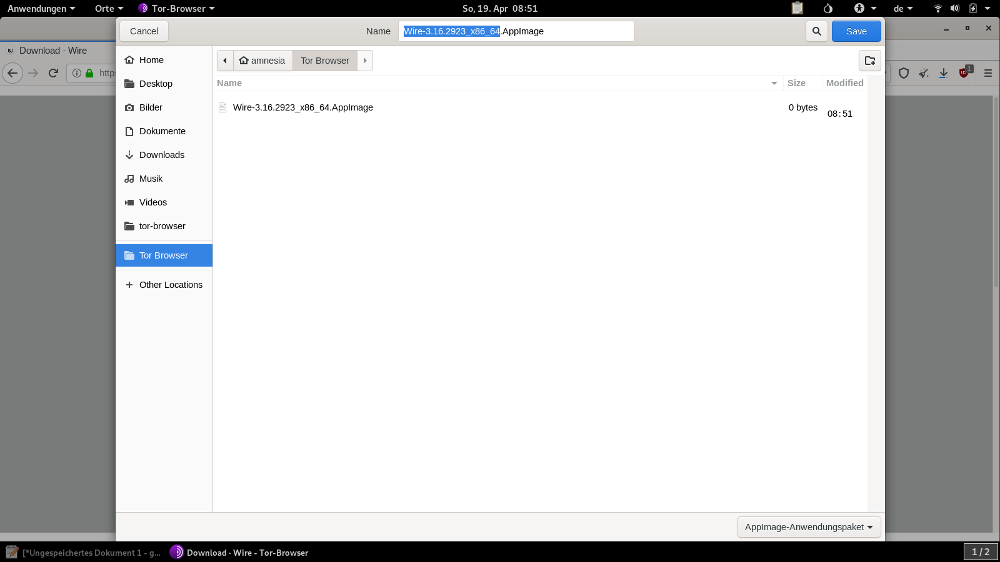


## Install the AppImage

1. Create a folder called "Wire" in your Persistent folder.
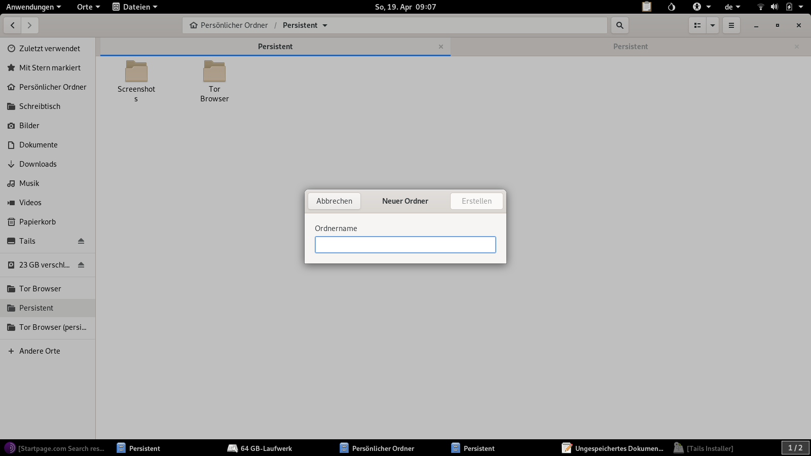
2. Move the downloaded file into your this folder, and rename it to ``Wire.AppImage``
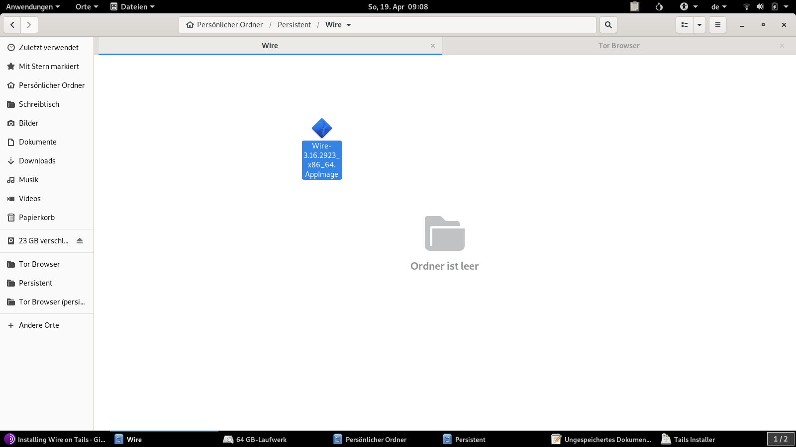
3. Right click on the ``Wire.AppImage`` file, select properties & make the App executable:

4. Create two empty folders next to it, and name them ``Wire.AppImage.config`` and ``Wire.AppImage.home``. This ensures that your conversations are saved in your Persistent folder, and you don't have to login each time again.
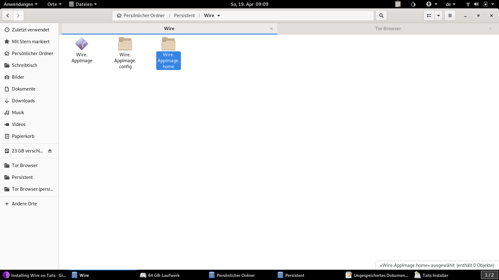
5. Create a text file with the following content and save it as  ``Wire.desktop`` into the Wire folder:
````
[Desktop Entry]
Encoding=UTF-8
Name=Wire
Exec='/home/amnesia/Persistent/Wire/Wire.AppImage' --no-sandbox --proxy-server="socks5://localhost:9050"
Type=Application
Categories=Network;
````

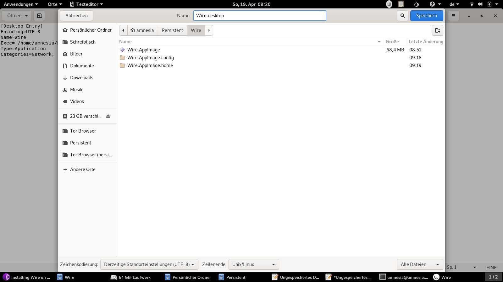

4. Open a Root Terminal & install the Wire.desktop link by pasting (right-click into the window and select paste) the following two commands in the command line:
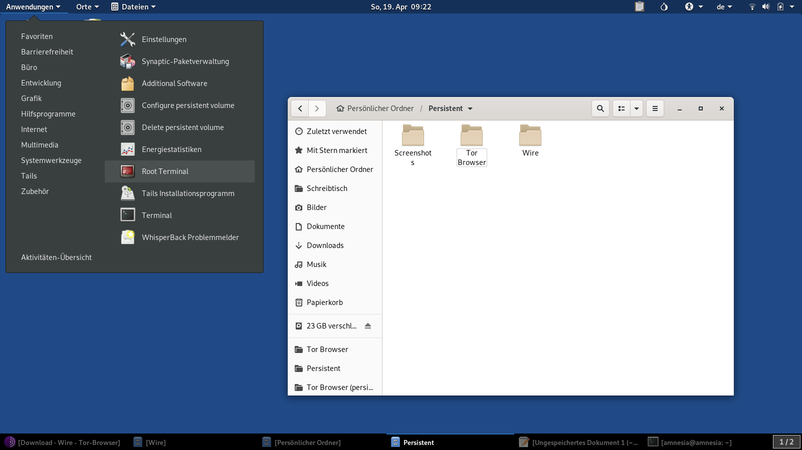

````
mkdir -p "/live/persistence/TailsData_unlocked/dotfiles/.local/share/applications"
````

Press enter and paste the next command:

````
ln -s "/home/amnesia/Persistent/Wire/Wire.desktop" "/live/persistence/TailsData_unlocked/dotfiles/.local/share/applications/Wire.desktop"
````
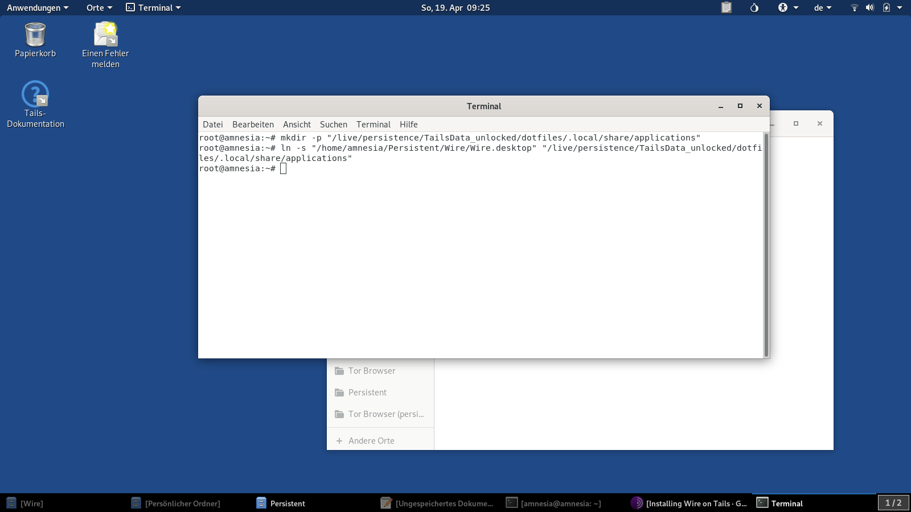
## Done
After a reboot you should find Wire as an entry in the Tails Application menu (category Network)
